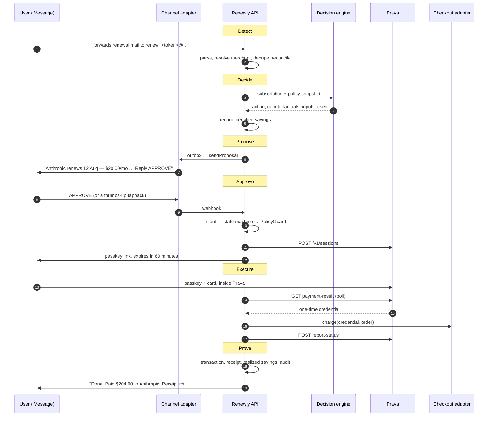

# @renewly/api

Renewly is a messaging-native renewal agent for founders. It **detects** upcoming renewals from
forwarded mail, files and bank statements, **decides** what to do about them, **proposes** the
action in iMessage or WhatsApp, **executes** the payment through [Prava](https://docs.prava.space)
behind a passkey, and **proves** it in the same thread with a receipt and a savings ledger.

**A phone thread is enough to complete a renewal.** Web is a control plane and a ledger view, not
the product surface.

```
mail / paste / CSV  →  decision  →  message  →  APPROVE  →  Prava  →  proof in-thread
```

---

## Quick start

```bash
pnpm install
cd apps/api
cp .env.example .env            # defaults work as-is
pnpm run db:migrate
pnpm run seed                   # demo@renewly.app / Demo1234!
pnpm run dev                    # http://localhost:4000
```

Nothing else needs to run: no Postgres, no Redis, no phone number, no API keys. See
[Database](#database) and [Modes](#modes) for why.

To start with a live proposal already waiting in the thread:

```bash
SEED_DEMO_FLOW=true pnpm run seed
```

### Scripts

| Script | What it does |
|---|---|
| `pnpm run dev` | Watch-mode server + in-process worker. Applies migrations at boot outside production. |
| `pnpm run build` / `start` | Compile to `dist` / run the compiled server |
| `pnpm run db:generate` | Generate a migration from `src/db/schema.ts` |
| `pnpm run db:migrate` | Apply migrations (Postgres or PGlite) |
| `pnpm run seed` | Demo user, workspace, simulator channel, merchant catalog |
| `pnpm test` | Unit + integration (448 tests) |
| `pnpm run test:e2e` | End-to-end journeys (90 tests) |
| `pnpm run lint` / `typecheck` | `tsc --noEmit` across src, tests and e2e |

---

## The loop



### The approval state machine

Every money-moving action walks this graph exactly once, and
[`stateMachine.ts`](src/modules/conversations/stateMachine.ts) is the only place a transition is
decided. An illegal move throws `INVALID_STATE_TRANSITION`.

```
drafted → notified → awaiting_intent ┬→ awaiting_payment_auth → executing ┬→ proved
                                     │                                    └→ failed
                                     └→ executing (attested actions skip the payment leg)

any non-terminal except executing → expired | cancelled_by_user
```

`executing` cannot be cancelled or expired: money is already in flight.

---

## Why a double APPROVE cannot charge twice

Four independent mechanisms, because at-least-once delivery is a fact and users tap twice:

1. **Inbound dedupe** — a replayed provider message id is dropped before it reaches the runtime.
2. **State machine** — `awaiting_payment_auth → awaiting_payment_auth` is not a legal transition.
3. **Compare-and-set** — `transition()` matches on the observed state in the `WHERE` clause, so
   of two concurrent writers exactly one updates a row.
4. **Idempotency table** — the pay pipeline runs inside `once(scope, key)`, whose unique index on
   `(scope, key)` is the actual guarantee. A repeat call replays the stored result.

`e2e/idempotency-double-approve.test.ts` fires four concurrent completes and asserts one
transaction, one receipt and one proof message.

---

## Modes

Everything external has a mock that follows the same state machine as the real thing, so the
entire journey runs with no keys at all.

| Subsystem | Env | mock (default) | live |
|---|---|---|---|
| Payments | `PRAVA_MODE` | in-process rail, test PAN | `sandbox` / `live` HTTP |
| iMessage | `LINQ_MODE` | accepts and records sends | Linq Partner API v3 + Standard Webhooks |
| WhatsApp | `WHATSAPP_MODE` | accepts and records sends | Cloud API + `x-hub-signature-256` |
| Inbound mail | `MAIL_MODE` | webhook accepted unsigned | verified per provider |
| Outbound mail | `MAIL_OUTBOUND_MODE` | captured in an in-memory mailbox | Resend `POST /emails` |
| Checkout | `CHECKOUT_ADAPTER_MODE` | validates and approves | signed POST to your test merchant |
| LLM | `LLM_API_KEY` | heuristic parser + deterministic narrative | OpenAI-compatible |

The **simulator** channel is always available and is not a mock of anything — it is a real channel
whose transport is the database. It is what makes the message-to-payment journey testable and
demoable without a phone.

### Failure injection

`MOCK_PRAVA_FAIL` drives the rail down a specific path: `mandate` (session refused), `card`
(credentials never arrive), `decline` (credentials for a PAN the adapter refuses).

---

## Honest boundaries

Three things this backend does **not** do, stated plainly because the alternative is a demo that
lies:

**Merchant settlement is ours.** Prava mints a real, usable one-time credential. Settling it
against Anthropic or Midjourney would mean driving their billing portals, which V1 does not do.
The credential is charged against a Renewly-controlled test merchant. The rail is real (or mocked
per env); the merchant leg is not.

**Cancellation and seat changes are performed by the user.** There is no cancellation API for
these vendors. `cancel/start` returns a checklist and a curated portal URL and moves the
subscription to `pending_cancel`. The thread says *"I cannot do this one for you — there is no
API"*. Nothing reaches the ledger as `realized` until the user replies DONE, and the audit event
records `automated: false`.

**No third-party integration has been run against a live key.** Every outbound client — Prava, Linq,
WhatsApp, Resend — is written to the vendor's published reference, and each one's request and response
shapes are asserted against a stubbed `fetch` in its own test file. There are no credentials in this
repo, so none of them has made a real call. If a field name has drifted, one adapter file is the fix.

| Integration | Written against | Contract test |
|---|---|---|
| Prava | [API reference](https://docs.prava.space/api-reference/overview) | `payments/pravaClient.test.ts` |
| Linq | [Partner API v3](https://docs.linqapp.com/api) | `channels/linq/adapter.test.ts` |
| WhatsApp | [Cloud API](https://developers.facebook.com/docs/whatsapp/cloud-api/reference/messages) | `channels/whatsapp/adapter.test.ts` |
| Mail webhooks | Mailgun / Svix signing docs | `intake/mail/verify.test.ts`, `lib/crypto.test.ts` |
| Resend (outbound) | [Send email](https://resend.com/docs/api-reference/emails/send-email) | `lib/mailer.test.ts` |
| LLM | [OpenAI structured outputs](https://platform.openai.com/docs/guides/structured-outputs) | exercised via the heuristic fallback |

---

## Identified vs realized savings

Two totals, never summed:

- **identified** — the agent's claim that an opportunity exists. Written when a decision finds a
  saving; replaced when the decision is regenerated.
- **realized** — money actually banked. Written when a payment settles or the user attests to a
  cancellation.

Realizing a saving **retires** the identified estimate for that subscription, so the same
opportunity is never counted as both a claim and a result. `GET /v1/savings/summary` returns
`{ identifiedTotal, realizedTotal, byActionType, ignoredCurrencies }`.

---

## The decision engine

[`engine.ts`](src/modules/decisions/engine.ts) is a pure function. It picks the action and computes
every number; the LLM writes only the headline and narrative, and any alternative it proposes is
discarded unless it matches the curated catalog at the catalog price.

Six actions, in evaluation order:

| Rule | Action |
|---|---|
| 1. Kill switch | flags the package; decisions still generate, only spending stops |
| 2. Unused 30+ days | `cancel` |
| 3. Idle seats (`seatsActive < seatsTotal`) | `rightsize_seats` with a seat target |
| 4. `must_keep` | `switch_term` if annual is cheaper, else `renew`; never cancels |
| 5. `experimental` above the ceiling | `switch_vendor`, or `cancel` if nothing is cheaper |
| 6. Over budget or category ceiling | `switch_vendor` → `cancel` → `rightsize_seats` |
| 7. Healthy and renewal 60+ days out | `snooze` — never proposed, so the agent stays quiet |

`renew`, `switch_term` and `switch_vendor` move money. `cancel` and `rightsize_seats` are attested
by the user. `snooze` does nothing.

Every rule that fires is recorded in `inputs_used[]`, and each package pins the `policy_version`
and the `priced_amount` it was built against — so a policy edit or a price change invalidates it
rather than silently paying the wrong number.

---

## Policy guard

Before any money moves, in order:

1. `KILL_SWITCH_ENABLED`
2. `CONFIRMATION_REQUIRED` — a gated field below 0.7 confidence and unconfirmed
3. `INVALID_DECISION_STATE` — superseded, expired, wrong subscription, an attested action, or a
   price that moved since the decision
4. `INVALID_DECISION_STATE` — requested amount disagrees beyond one minor unit
5. `APPROVAL_REQUIRED` — `auto_within_envelope` and above the ceiling

The guard runs on **both** session creation and completion, because the kill switch can be pulled
in between. `POST /v1/settings/simulate` answers "what would change if I loosened policy" against
open decisions without executing anything.

---

## The simulator journey, by hand

```bash
SEED_DEMO_FLOW=true pnpm run seed && pnpm run dev

TOKEN=$(curl -s -X POST localhost:4000/v1/auth/login \
  -H 'content-type: application/json' \
  -d '{"email":"demo@renewly.app","password":"Demo1234!"}' | jq -r .token)
AUTH="authorization: Bearer $TOKEN"

# 1. See the proposal the agent already sent
curl -s localhost:4000/v1/channels/simulator/messages -H "$AUTH" | jq -r '.messages[].body'

# 2. Reply APPROVE as the user's phone would
curl -s -X POST localhost:4000/v1/webhooks/simulator \
  -H 'content-type: application/json' \
  -d '{"from":"+15550100001","text":"APPROVE","messageId":"m1"}' | jq

# 3. The thread now holds a passkey link. Complete the payment.
APR=$(curl -s "localhost:4000/v1/approvals?limit=1" -H "$AUTH" | jq -r '.approvals[0].id')
curl -s -X POST "localhost:4000/v1/approvals/$APR/prava/complete" -H "$AUTH" | jq

# 4. Proof, receipt and ledger
curl -s localhost:4000/v1/channels/simulator/messages -H "$AUTH" | jq -r '.messages[-1].body'
curl -s localhost:4000/v1/savings/summary -H "$AUTH" | jq
curl -s "localhost:4000/v1/audit?limit=30" -H "$AUTH" | jq -r '.events[].type'
```

Forwarded mail, without a mail provider:

```bash
TOKEN_ADDR=$(curl -s localhost:4000/v1/intake/mail-address -H "$AUTH" | jq -r .address)
curl -s -X POST localhost:4000/v1/webhooks/mail/mailgun \
  -H 'content-type: application/json' \
  -d "{\"recipient\":\"$TOKEN_ADDR\",\"from\":\"billing@anthropic.com\",
       \"subject\":\"Your Claude Pro subscription renews on August 12, 2026\",
       \"body-plain\":\"Total: \$20.00 USD\nRenews on August 12, 2026, billed monthly.\"}" | jq
```

---

## API

Auth is `Authorization: Bearer <jwt>`, or the httpOnly `renewly_session` cookie. Money is a decimal
string. Timestamps are ISO 8601 UTC. Lists take `?cursor=&limit=`.

| Method | Path | Purpose |
|---|---|---|
| `GET` | `/health`, `/v1/demo/status` | Liveness; which modes are configured (booleans only) |
| `POST` | `/v1/waitlist` | Public pre-launch signup; stores the address and sends the welcome mail |
| `POST` | `/v1/contact` | Public contact form; mails the message to `CONTACT_NOTIFY_TO` |
| `POST` | `/v1/auth/signup`, `/login`, `/logout` | Credentials |
| `GET` | `/v1/me` | User, workspace, settings |
| `GET` `PATCH` | `/v1/settings` | Budget, ceiling, approval mode, quiet hours, primary channel |
| `POST` | `/v1/settings/kill-switch` | `{ enabled }` |
| `POST` | `/v1/settings/simulate` | What would be auto/ask/blocked under a different policy |
| `GET` | `/v1/channels` | Connected channels |
| `POST` | `/v1/channels/connect` | `{ channel, externalId }` |
| `DELETE` | `/v1/channels/:id` | Revoke |
| `GET` | `/v1/channels/simulator/messages` | The simulator thread (dev and test) |
| `POST` | `/v1/webhooks/linq`, `/whatsapp`, `/simulator` | Inbound messages |
| `GET` `POST` | `/v1/webhooks/whatsapp` | Meta verification handshake + messages |
| `POST` | `/v1/webhooks/mail/:provider` | Inbound mail, routed by plus-address token |
| `GET` | `/v1/intake/mail-address` | This workspace's forwarding address |
| `POST` | `/v1/intake/email`, `/file`, `/csv` | Paste, upload, statement import |
| `GET` `POST` | `/v1/intake/csv/:importId/candidates`, `/candidates/:id/accept\|reject` | CSV triage |
| `GET` `POST` | `/v1/subscriptions` | Inventory |
| `GET` `PATCH` `DELETE` | `/v1/subscriptions/:id` | |
| `POST` | `/v1/subscriptions/:id/confirm` | Clear the confidence gate |
| `POST` | `/v1/subscriptions/:id/decisions` | `{ regenerate, notify, channel }` |
| `GET` | `/v1/subscriptions/:id/decisions`, `/v1/decisions/:id` | History and detail |
| `POST` | `/v1/decisions/:id/approvals` | Create the approval and send the proposal |
| `GET` | `/v1/approvals`, `/v1/approvals/:id` | |
| `POST` | `/v1/approvals/:id/intent` | Web fallback for a chat reply |
| `GET` | `/v1/approvals/:id/pay-bootstrap?token=` | What the pay page needs to mount Prava |
| `POST` | `/v1/approvals/:id/prava/complete` | Poll, charge, report, prove |
| `POST` | `/v1/approvals/:id/cancel/start`, `/cancel/confirm` | Attested actions |
| `POST` | `/v1/decisions/:id/pay/session`, `/pay/complete` | Direct pay path (web) |
| `GET` | `/v1/payment-sessions/:id` | Session status |
| `GET` | `/v1/receipts`, `/v1/receipts/:id` | Receipt vault |
| `GET` | `/v1/savings`, `/v1/savings/summary` | Identified and realized |
| `GET` | `/v1/audit?type=&limit=&cursor=` | Append-only audit log |

### Waitlist

The one public, pre-account endpoint. **Success means the whole loop finished** — row written,
position assigned, welcome mail delivered, internal notice delivered. Any step short of that is an
error rather than a partial success, so the form can never say "you're in" when nobody was mailed.

```bash
curl -s -X POST localhost:4000/v1/waitlist -H 'content-type: application/json' \
  -d '{"email":"founder@example.com","name":"Ada Lovelace","source":"landing-hero"}'
```

```json
{ "waitlist": { "email": "founder@example.com", "position": 1, "alreadyJoined": false,
                "mail": "sent", "joinedAt": "2026-01-01T00:00:00.000Z" } }
```

- `201` for a new address, `200` when it was already on the list. A repeat submission keeps the
  original place in line and does not send a second mail.
- A mail that cannot be sent is `502 CHANNEL_SEND_FAILED`. The row is **kept**, because deleting it
  would turn a provider outage into a lost signup — but the response is still a failure.
- The row records which of the two mails landed (`welcome_sent_at`, `notice_sent_at`), so
  re-submitting a failed address sends only what is still owed. A retry resumes the loop; it never
  mails anyone twice.
- The internal notice goes to `WAITLIST_NOTIFY_TO`, with `Reply-To` set to the person who signed up.
- Rate limited to 20/minute per IP, on top of the global ceiling. `name`, `source` and `referrer`
  are optional; `referrer` falls back to the request's `Referer` header.
- In `MAIL_OUTBOUND_MODE=mock` nothing leaves the process — read what would have been sent with
  `readMailbox()` from `src/lib/mailer.ts`.
- Every step is logged against the request id: the raw body as it arrived, the parsed input, the
  row, each mail send, the provider's verbatim response, and the exact body being returned. In
  development those lines are colourised by `pino-pretty`; elsewhere they stay JSON.

### Contact

The waitlist's simpler sibling: public, unauthenticated, and mail-only. **Nothing is stored** —
the message is the mail and the inbox is the store, so there is no table, no id and no dedupe.

```bash
curl -s -X POST localhost:4000/v1/contact -H 'content-type: application/json' \
  -d '{"name":"Ada Lovelace","email":"ada@example.com","message":"We renew Datadog in August."}'
```

```json
{ "contact": { "email": "ada@example.com", "sentAt": "2026-01-01T00:00:00.000Z" } }
```

- `201` once the provider has accepted the mail. All three fields are required; `message` is capped
  at 5000 characters and the address is lowercased before it is used as `Reply-To`.
- A mail that cannot be sent is `502 CHANNEL_SEND_FAILED`. Since nothing was persisted, the caller
  can simply resubmit — the form must never say "message sent" when it was not.
- The message goes to `CONTACT_NOTIFY_TO`, with `Reply-To` set to the sender, so replying from the
  inbox answers them directly.
- Rate limited to 10/minute per IP, tighter than the waitlist because every accepted request sends
  a mail.
- In `MAIL_OUTBOUND_MODE=mock` nothing leaves the process — read what would have been sent with
  `readMailbox()` from `src/lib/mailer.ts`.

### Errors

```json
{ "error": { "code": "KILL_SWITCH_ENABLED", "message": "Agent spend is disabled", "details": {} } }
```

| Code | HTTP |
|---|---|
| `VALIDATION_ERROR` | 400 |
| `UNAUTHORIZED`, `WEBHOOK_INVALID_SIGNATURE` | 401 |
| `CHECKOUT_DECLINED` | 402 |
| `FORBIDDEN` | 403 |
| `NOT_FOUND` | 404 |
| `CONFLICT`, `KILL_SWITCH_ENABLED`, `CONFIRMATION_REQUIRED`, `APPROVAL_REQUIRED`, `INVALID_DECISION_STATE`, `INVALID_STATE_TRANSITION`, `CHANNEL_NOT_CONNECTED`, `APPROVAL_EXPIRED`, `DUPLICATE_IDEMPOTENCY` | 409 |
| `PAYLOAD_TOO_LARGE` | 413 |
| `RATE_LIMITED` | 429 |
| `INTERNAL_ERROR` | 500 |
| `PRAVA_ERROR`, `CHANNEL_SEND_FAILED` | 502 |

---

## Database

The schema is PostgreSQL — `jsonb`, `numeric`, native enums, 24 tables. `DATABASE_URL` picks the
driver, and **the same generated migrations run on all three**:

| `DATABASE_URL` | Driver | Use |
|---|---|---|
| `postgresql://…` | node-postgres | Production, CI |
| `pglite://./.data/renewly` | PGlite (in-process Postgres, WASM) | Local dev, default |
| `pglite://memory` | PGlite, in memory | Tests |

PGlite is the default because it removes "install Postgres first" without swapping the dialect for
SQLite and quietly changing semantics. For real Postgres: `docker compose up -d`.

---

## Architecture

```
src/
  index.ts · app.ts · env.ts
  db/                    schema (24 tables), dual-driver client, migrator
  lib/                   money · errors · logger · id · llm · http · crypto · idempotency
  middleware/            auth · errorHandler · requestId · rateLimit · securityHeaders
  modules/
    waitlist/                       public pre-launch signup + welcome mail
    contact/                        public contact form, mail-only, stores nothing
    auth/ workspaces/ settings/     identity and policy
    merchants/                      canonical vendor graph, aliases, cancel URLs
    subscriptions/                  inventory, seats, confidence gate
    intake/
      emailParser · csvParser       heuristic extraction, recurrence detection
      mail/                         inbound webhook, plus-address routing, dedupe, reconcile
    decisions/  engine · catalog    pure rules + curated alternatives
    conversations/
      stateMachine                  the approval graph, pure
      intentParser                  chat reply → intent, pure
      composer                      every string the agent sends, pure
      runtime                       notify, handle inbound, deliver outbound
    channels/  types · registry     simulator · linq · whatsapp adapters
    approvals/                      the spine binding decision ↔ message ↔ payment
    payments/  pravaClient · pravaMock · checkoutAdapter · policyGuard · executor
    actions/                        attested cancel and rightsize
    ledger/  audit/                 receipts, identified/realized savings, audit
    workers/  queues · runner       outbox drain, expiry, jobs
```

The state machine, intent parser, composer, decision engine, policy guard and money helpers are
pure functions with no I/O — which is why they carry the densest tests. Routes stay thin; services
orchestrate.

### Workers

`WORKER_ENABLED=true` runs an in-process loop that drains the outbox, expires approvals past their
TTL, and processes jobs (`parse_inbound_email`, `send_outbound`, `poll_prava`, `expire_approvals`,
`notify_decision`). Delivery is at-least-once, so every processor is idempotent. Jobs live in a
database table rather than Redis: one fewer service, and job state sits beside the data it acts on.
For a multi-instance deploy, run the worker as its own process with the API's `WORKER_ENABLED=false`.

Outbound goes through an **outbox** rather than straight to a provider, so a transient failure
cannot lose a proposal and quiet hours can defer a message without dropping it. Proofs and failures
ignore quiet hours: the user is mid-flow.

---

## Testing

```bash
pnpm test        # 448 unit + integration
pnpm run test:e2e   # 90 across 8 journeys
```

Every test file boots its own in-memory Postgres via PGlite and applies the real migrations, so
tests run in parallel with no shared state and no external service. `NODE_ENV=test` deletes
`LLM_API_KEY`, so no test can reach a real model or spend money. The worker loop is not started in
tests; the harness drives `flushOutbox()` explicitly so delivery is deterministic.

**Unit** — money arithmetic, the state machine's full transition matrix (legal, illegal, terminal,
same-state), intent parsing including negation and tapbacks, every composed message, the decision
rule matrix, the policy guard, the checkout adapter, the Prava mock, merchant resolution, content
hashing, idempotency under concurrency.

**Integration** — auth and workspace isolation, subscriptions and the confidence gate, email/file/
CSV intake, decisions and supersession, the pay path, channel connect and inbound intents, expiry,
cancel and rightsize, identified/realized ledger, audit chains, waitlist signup including
duplicate submission, a failing mail provider and a retry that resumes the loop.

**E2E journeys**

| File | Covers |
|---|---|
| `message-pay-happy-path` | signup → channel → mail → decision → proposal → APPROVE → passkey link → pay-bootstrap → complete → proof → audit chain → kill switch |
| `message-cancel-path` | cancel and rightsize by attestation, realized savings, no receipt |
| `policy-blocks` | kill switch, spend ceiling, unconfirmed parse, superseded decision, price drift, policy simulation |
| `idempotency-double-approve` | double APPROVE, replayed webhook, sequential and concurrent completes → one transaction |
| `mail-inbound` | plus-address routing, duplicate detection, price change re-gating, forged From header |
| `failure-prava-decline` | decline, abandoned iframe, refused mandate, slow collection, recovery |
| `renewal-happy-path`, `failure-paths` | the direct web pay path, retained from V1 |

---

## Environment

See `.env.example`. Everything has a working default except `AUTH_SECRET` in production.

| Variable | Notes |
|---|---|
| `DATABASE_URL` | Postgres URL, or `pglite://<path>` / `pglite://memory` |
| `AUTH_SECRET` | 32+ chars; boot fails in production if left at the default |
| `LLM_API_KEY` `LLM_BASE_URL` `LLM_MODEL` | Optional; absent means the heuristic path |
| `PRAVA_MODE` `PRAVA_SECRET_KEY` `PRAVA_PUBLISHABLE_KEY` `PRAVA_API_BASE` | Payment rail; `sandbox` wants `sk_test_*`, `live` wants `sk_live_*` |
| `PRAVA_MERCHANT_FALLBACK_URL` `PRAVA_MERCHANT_COUNTRY` | `merchant_details` for vendors the merchant graph has no website for |
| `LINQ_MODE` `LINQ_API_KEY` `LINQ_WEBHOOK_SECRET` `LINQ_FROM_NUMBER` `LINQ_BASE_URL` | iMessage; `LINQ_FROM_NUMBER` is a provisioned line and is required to start a chat |
| `WHATSAPP_MODE` `WHATSAPP_TOKEN` `WHATSAPP_PHONE_NUMBER_ID` `WHATSAPP_VERIFY_TOKEN` `WHATSAPP_APP_SECRET` `WHATSAPP_GRAPH_VERSION` | WhatsApp Cloud API; graph versions expire ~2 years after release |
| `MAIL_MODE` `MAIL_WEBHOOK_SECRET` `MAIL_INBOUND_DOMAIN` | Inbound mail; the secret's meaning depends on the provider (see Webhook setup) |
| `MAIL_OUTBOUND_MODE` `MAIL_OUTBOUND_API_KEY` `MAIL_FROM` `MAIL_REPLY_TO` | Outbound mail via Resend; `mock` captures instead of sending |
| `WAITLIST_NOTIFY_TO` | Where the internal waitlist notice goes; a signup fails if it cannot be delivered |
| `CONTACT_NOTIFY_TO` | Where contact-form messages go, with `Reply-To` set to the sender |
| `CHECKOUT_ADAPTER_MODE` `CHECKOUT_ADAPTER_URL` `CHECKOUT_ADAPTER_SECRET` | Merchant settlement |
| `WORKER_ENABLED` `WORKER_POLL_INTERVAL_MS` `APPROVAL_TTL_MINUTES` | Worker loop |
| `SEED_SAMPLE_SUBS` `SEED_DEMO_FLOW` | Seed behaviour, both off by default |

### Webhook setup

Providers disagree on what a signature covers, and the differences are not cosmetic — verifying a
body HMAC against a sender that signs something else accepts everything, or nothing.

- **Linq** — point inbound messages at `POST /v1/webhooks/linq` and set `LINQ_WEBHOOK_SECRET` to the
  subscription's `whsec_` value. Linq uses the [Standard Webhooks](https://www.standardwebhooks.com/)
  spec: a base64 HMAC-SHA256 over `{webhook-id}.{webhook-timestamp}.{body}`, keyed on the decoded
  secret, with deliveries older than five minutes rejected as replays.
- **WhatsApp** — the callback URL is `/v1/webhooks/whatsapp`; Meta's `GET` handshake is answered
  using `WHATSAPP_VERIFY_TOKEN`, and `POST` bodies are verified against `x-hub-signature-256`, a hex
  HMAC-SHA256 of the raw body keyed on `WHATSAPP_APP_SECRET`.
- **Mail** — configure the provider to POST to `/v1/webhooks/mail/<provider>`, where `<provider>`
  selects the verifier: `mailgun` signs `timestamp + token` and sends the three values as payload
  fields (form-encoded or nested under `signature`), `resend` uses Standard Webhooks via Svix, and
  anything else falls back to a hex HMAC of the raw body in `x-webhook-signature`. Routing uses the
  plus-address token on the recipient, never the sender.

---

## Security

- No PAN or CVV is ever persisted, returned or logged. The credential exists as a local constant
  for the duration of the checkout call; the logger redacts `cardNumber`, `cvv`, `dynamic_cvv`,
  `token` and `credentials` at every depth; `transactions` has `card_last4` and no column that
  could hold a PAN. Tests assert absence against responses, stored rows, receipts and the audit log.
- Webhook signatures verified in constant time; a mismatch is `WEBHOOK_INVALID_SIGNATURE` (401).
- Mail routes on the plus-address token, never the forgeable `From` header.
- Pay links carry a single-use token; only its SHA-256 is stored.
- Zod validation on every input, at the route boundary. Central error handler; domain errors map to
  fixed statuses and never leak internals.
- Request id on every log line and response. CORS allowlist. Strict headers on a JSON-only surface.
- bcrypt hashing; login compares against a real hash even when the user does not exist, so response
  time does not disclose whether an address is registered.
- In-memory rate limiting, tighter on credential routes (a multi-instance deploy needs a shared store).
- Every query is workspace-scoped and parameterised through Drizzle. Upload and CSV row limits
  enforced before parsing.

---

## Relationship to `apps/web`

The marketing site is untouched and still runs against its own mock layer. Its domain types model
the same product with different vocabulary — opportunities and actions rather than decision
packages and approvals, integer cents rather than decimal strings. Wiring the two together is a
front-end adapter and deliberately out of scope.
